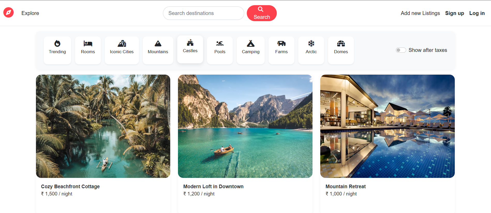
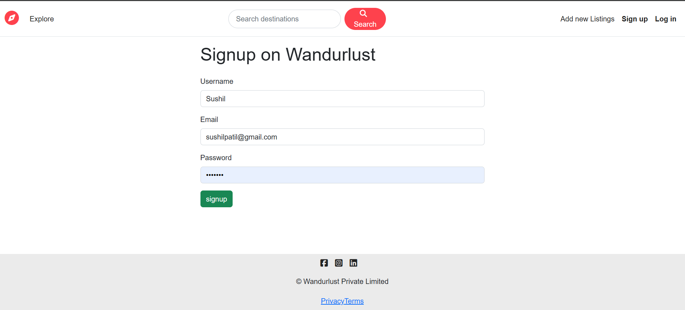
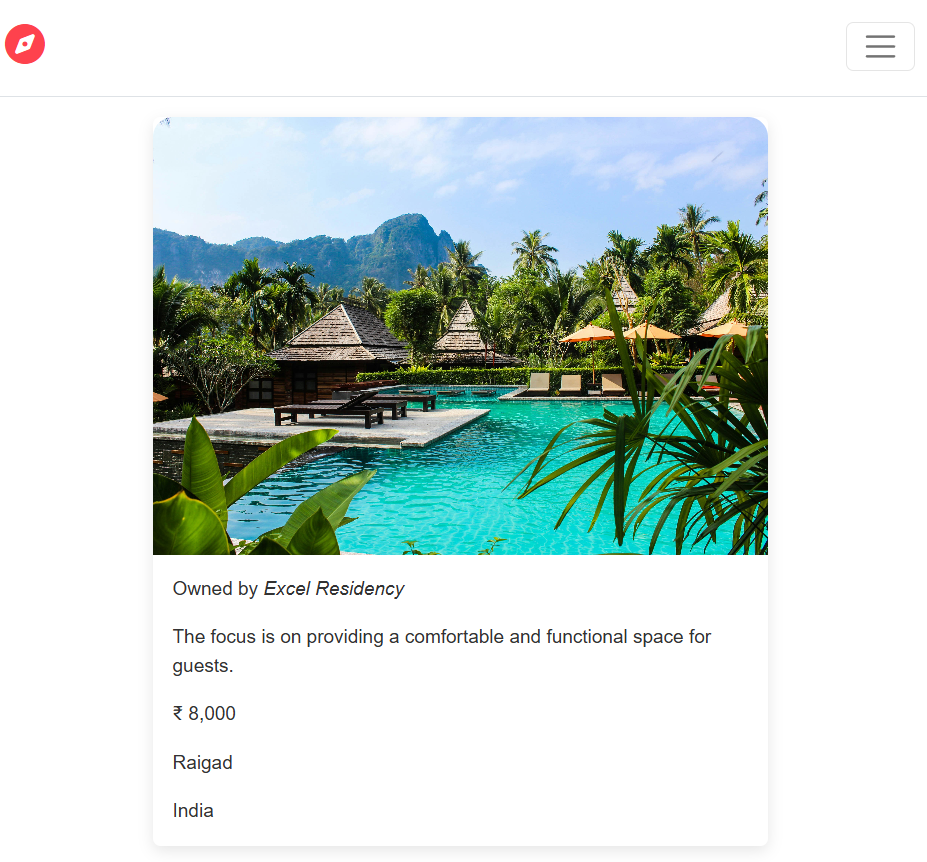
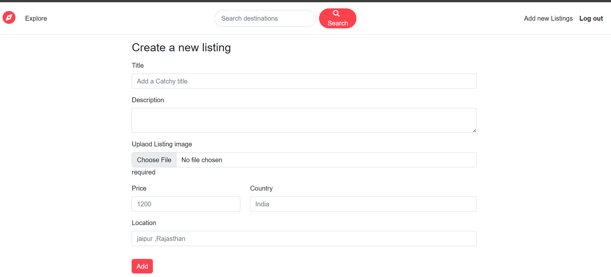

# 🏡 WandurStay

WandurStay is a full-stack web platform designed to make it easy for users to **find, book, and manage stays or homestays** seamlessly.  
It provides a modern and interactive UI for guests and hosts to connect, browse properties, and manage bookings in real time.

---

## 🚀 Features

- 🏠 **Browse and Book** stays with detailed information  
- 👤 **User Authentication** (Login/Register)  
- 💬 **Contact Form** for inquiries  
- 🧾 **Dynamic EJS Templates** with reusable components (footer, navbar, etc.)  
- 🗂️ **Single Route File** handling reports and contact forms  
- 💻 **MongoDB Integration** for persistent data storage  
- ⚡ **Responsive UI** built with HTML, CSS, and JavaScript  
- 🔐 **Secure Backend** built with Node.js and Express

---

## 🛠️ Tech Stack

**Frontend:** HTML, CSS, JavaScript, EJS  
**Backend:** Node.js, Express.js  
**Database:** MongoDB  
**Template Engine:** EJS with ejs-mate  
**Version Control:** Git and GitHub  

---

## 🖼️ Project Screenshots

## 🖼️ Project Screenshots

### 🧭 Dashboard  

### 📝 Signup Page  

### 🏨 Hotel Information Page  

### 🏗️ Create New Listing  

